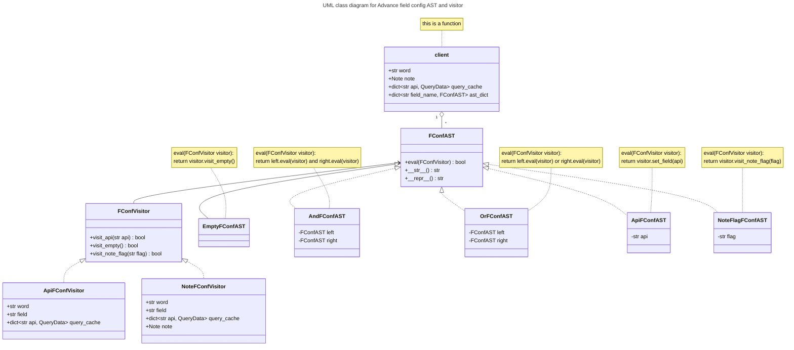

# Design Spec for Advanced field config AST and visitor

## Introduction

An AST of unified user configuration setting for each field, old boolean setting can adapt to it.

User config field stored in string can be parsed to AST.

E.g., `api:"有道 API" | api:"欧路词典 API" | flag:1`, is parsed to an AST with 3 leaves:

```text
      or_ast
        / \
       /   \
  or_ast  flag_ast
     / \
    /   \
api_ast  api_ast
```

In this example, "有道 API" is first to evaluate, if it fails, fallback to "欧路词典 API", then fallback to flag 1 (red flag).

Parser supports `api` and `flag` expression, parenthesis expression, and two binary expressions: OR and AND with operators of `|` and `&` respectively. API name should be double-quoted if contains spaces or either of the characters `:()&|"`, since these characters are special delimiters. `"` should follow a backslash (`\"`) inside a double-quoted-string. API name cannot be exact `api` or `flag` unless it's quoted: `api:"api"`.

When evaluating the AST, specific visitor function is called so that corresponding action is made. For example, `ApiFConfVisitor` is implemented for API query, `NoteFConfVisitor` for saving and flagging note in database, `MoveAudioFConfVisitor` for moving downloaded audios to Anki media folder when saving notes.

## UML class diagram


